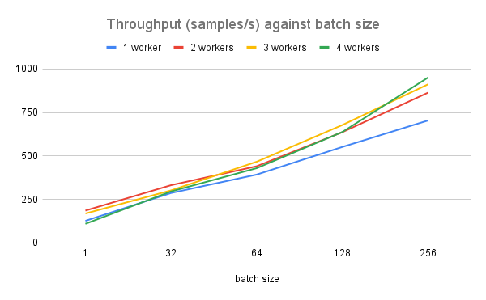
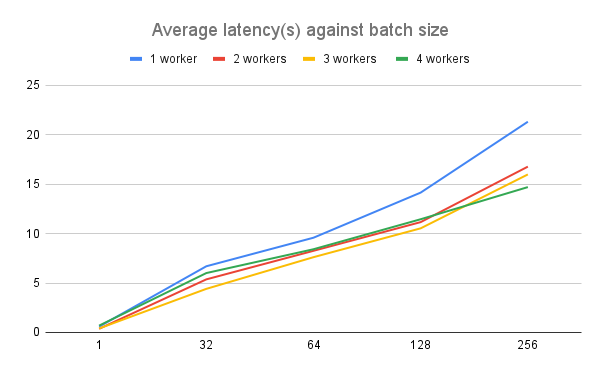

### [115286](https://github.com/pytorch/pytorch/pull/115286)
* Prior to this PR, the backend worker was a process that read from the request queue, ran the model's forward and put the output in the response queue. In this PR, create a `ThreadPoolExecutor` with 1 worker and asynchronously run the model forward and response step in the executor so that it doesn't block polling the queue for more requests.

##### Results
* Warmup latency improved (likely due to the backend no longer being a new process) but all other metrics were worse.

### [115837](https://github.com/pytorch/pytorch/pull/115837)
* Fixed two bugs in metrics calculation:
    * Before this PR, each `request_time` was separated by the time for a `torch.randn(...)` to create the fake `data` tensor on CPU. This meant that the gap between requests incorrectly scaled with the batch size. Since the latency was calculated by `response_time - request_time`, the latencies were not comparable over different batch sizes.
    * Corrected calculation of throughput: previously `(num_batches * batch_size) / sum(response_times)`, now `(num_batches * batch_size) / (last_response_time - first_request_time)`
* Fixed bug where responses sent to frontend are on GPU.
* Used a semaphore to ensure writing to `metrics_dict` in `metrics_thread` and `gpu_utilization_thread` in a thread-safe manner.

##### Results
* Baseline metrics were reset due to the bugs listed above.

### [115839](https://github.com/pytorch/pytorch/pull/115839)
* Added two `ThreadPoolExecutor`s with 1 worker each for D2H and H2D copies. Each uses its own `cuda.Stream`. The purpose is to try to overlap D2H and H2D with compute and allow the worker handling prediction to launch compute kernels without being blocked by D2H/H2D.
    * One thread pins memory of the CPU request and copies it into a CUDA tensor
    * One thread moves the response to CPU and places it into the response queue
Semaphores are used in conjunction with `cuda.Event`s to ensure proper synchronization among the threads.

##### Results:
* Warmup latency decreases as compared to the baseline for all batch sizes.
* For batch sizes 1, 32, 64 we observed that metrics were worse
    * Average latency increased
    * Throughput decreased
    * GPU utilization decreased
* For batch sizes 128 and 256 we observed metrics improved
    * Average latency decreased
    * Throughput increased
    * GPU utilization increased

### [115480](https://github.com/pytorch/pytorch/pull/115480)
* Added a `--num_workers` option to `server.py` that allows more than 1 worker in the `ThreadPoolWorker` used for model predictions. Each worker uses its own `cuda.Stream()` that is created when the worker thread is initialized.

##### Results:
Benchmarks were only run for `compile=False` since `torch.compile()` is not thread-safe. Benchmarks were run with `num_workers={2, 3, 4}`.

For the 2 worker case:
* All metrics improved compared to the single worker case across all batch sizes.
* For batch sizes 1, 32 and 64 we observed that the metrics were still slightly worse than the baseline.
* For batch sizes 128 and 256 we observed that all metrics beat the baseline (e.g. ~300 samples/sec increase in throughput, ~5s decrease in average latency and ~2s decrease in warmup latency for bs=256)

